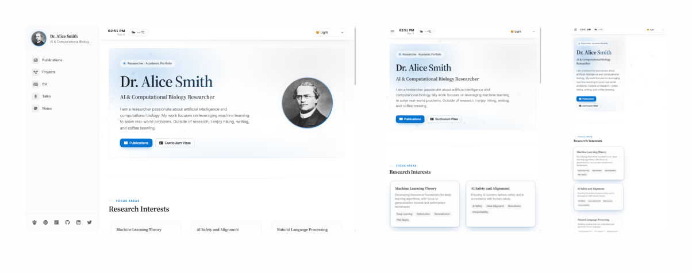

# Hexo Theme Researcher

A modern, responsive, and professional academic portfolio theme for researchers.

[](https://github.com/jiehua1995/hexo-theme-researcher/blob/main/LICENSE)
[](https://github.com/jiehua1995/hexo-theme-researcher/stargazers)
[](https://github.com/jiehua1995/hexo-theme-researcher/network/members)
[](https://github.com/jiehua1995/hexo-theme-researcher/issues)
[](https://github.com/jiehua1995/hexo-theme-researcher/commits)
[](https://hexo.io/)
[](https://hexo-theme-researcher.jiehua1995.xyz/)
[](https://deepwiki.com/jiehua1995/hexo-theme-researcher)


### Demo

Responsive preview of the homepage across **desktop · tablet · mobile**:



A looping walkthrough of the homepage (scroll-focus card effect + falling background animation):


## Design Philosophy

The Researcher theme is designed with the following principles in mind:

- **Professional & Clean**: A minimalist design that puts your academic work in the spotlight
- **Modern & Responsive**: Built with the latest web technologies for optimal viewing on all devices
- **Accessible & Fast**: Optimized for performance and accessibility
- **Customizable**: Easy to personalize with your own colors, fonts, and content
- **Academic-Focused**: Specialized features for showcasing publications, projects, and academic achievements

## Features

- 📱 **Fully responsive design** - Mobile-first approach with optimal viewing on all devices
- 🎨 **30+ DaisyUI themes** - Light, dark, cupcake, bumblebee, wireframe and more
- 🔄 **Detail / Compact view toggle** - Publications, Projects, Talks & Notes switch views (persisted per page); switching resets every card to that mode's default
- 🔽 **Per-card expand / collapse** - Every card has a chevron that works in both Detail & Compact — expand a collapsed card to see the full detail or fold one back to a row
- 🏠 **Enhanced homepage** - Recent Notes, Featured Publications & Projects in 3-column layouts
- 📝 **Blog/Notes system** - Real-time search, filtering, an interactive tag cloud, and clean typography
- 🔍 **Site-wide search** - Real-time search across all content (requires `hexo-generator-search`)
- 📚 **Publications management** - Academic showcase with DOI, PDF links, and citation badges
- 🔬 **Citation badges** - Dimensions + Altmetric badges in the card corner; in Compact only the Dimensions badge shows (with the article's own type badge); popovers never clipped
- 📊 **Project showcase** - Status tracking, GitHub integration, and collaboration details
- 📄 **Professional CV page** - Downloadable resume with modular sections
- 🎤 **Talks & presentations** - Conference and seminar showcase
- 💻 **Enhanced code display** - Syntax highlighting with line numbers and copy functionality
- 🔀 **SPA partial navigation (Swup)** - Sidebar & top bar persist while only the content swaps
- ⚡ **Ambient background animation** - Falling "science" glyphs drift down the page like snow (configurable)
- 🧭 **Focus-wheel table of contents** - Sticky, click-to-centre TOC for articles and the CV page
- 🔗 **Academic profiles** - Google Scholar, ORCID, ResearchGate, GitHub, LinkedIn
- ⚙️ **Feature switches** - Turn every visual/functional enhancement on/off from `_config.yml`
- ⚡ **Performance optimized** - Fast loading with modern web technologies

## Usage

### Prerequisites
- Node.js (version 12.0 or higher)
- npm or yarn package manager

### Step-by-Step Installation

1. **Install Hexo CLI globally:**
```bash
npm install -g hexo-cli
```

2. **Create a new Hexo site:**
```bash
hexo init my-academic-site
cd my-academic-site
```

3. **Install required Hexo packages:**
```bash
yarn install
```

4. **Install theme dependencies (required for search functionality):**
```bash
yarn add hexo-generator-search --save
```

5. **Clone the theme:**
```bash
git clone https://github.com/jiehua1995/hexo-theme-researcher themes/hexo-theme-researcher
```

6. **Configure your main site** by editing `_config.yml` in your site's root directory:
```yaml
# Site Information
title: Your Name
subtitle: Your Academic Title
description: Your research description and academic bio
keywords: research, academic, portfolio, your-field
author: Your Name
language: en
timezone: ''

# URL Configuration
url: https://yourusername.github.io
root: /
permalink: :year/:month/:day/:title/
permalink_defaults:
  lang: en

# Theme Configuration
theme: hexo-theme-researcher

# Search Configuration (Required for search functionality)
search:
  path: search.xml
  field: post
  content: true

# Deployment (example for GitHub Pages)
deploy:
  type: git
  repo: https://github.com/yourusername/yourusername.github.io.git
  branch: main
```

7. **Create the required pages** that the theme uses to display your academic content.

Before using the theme, you need to create the following pages in your Hexo site:

```bash
# Create all required pages
hexo new page publications
hexo new page projects
hexo new page talks
hexo new page cv
hexo new page notes
```

After creating each page, you **must** set the correct layout in the front-matter of each page's markdown file:

**Publications page** (`source/publications/index.md`):
```yaml
---
title: Publications
date: 2024-01-01
layout: publications
---
```

**Projects page** (`source/projects/index.md`):
```yaml
---
title: Projects
date: 2024-01-01
layout: projects
---
```

**CV page** (`source/cv/index.md`):
```yaml
---
title: CV
date: 2024-01-01
layout: cv
---
```

**Talks page** (`source/talks/index.md`):
```yaml
---
title: Talks
date: 2024-01-01
layout: talks
---
```

**Notes page** (`source/notes/index.md`):
```yaml
---
title: Notes
date: 2024-01-01
layout: notes
---
```

> The Contact page is no longer a separate page — contact links (email, address, academic profiles) are shown in a simple link row at the bottom of the homepage.

**Important Notes**

- The `layout` field must match the page name exactly
- The Notes page will automatically display all your blog posts
- The Recent Notes section on the homepage will show the 3 latest posts automatically

Edit `_config.yml` in the theme directory to customize your site:

8. **Configure the theme** by editing the `_config.yml` file located in the `themes/hexo-theme-researcher` directory. Edit `_config.yml` in the theme directory to customize your site.

   It will be better to copy the `_config.yml` out as `_config.hexo-theme-researcher.yml ` into the main folder.

```bash
cp themes/hexo-theme-researcher/_config.yml _config.hexo-theme-researcher.yml
```

9. **Create blog posts** by adding markdown files in the `source/_posts` directory.
To create blog posts, use the standard Hexo command:
```bash
hexo new post "Your Post Title"
```

​	Then you could write whatever you want, those notes will be shown in **Notes** page.

9. **Create data files** in the `source/_data` directory to manage your academic content.

   Create the following data files in your site's `source/_data` directory. You can find example data in the theme's `demo_data` folder:

- `publications.yml`: Your academic publications
- `projects.yml`: Research projects
- `talks.yml`: Presentations and talks
- `cv.yml`: Your CV/resume information

## Configuration reference

The theme is configured by copying the theme's `_config.yml` into the site root as `_config.hexo-theme-researcher.yml`. Key switches:

### `motion` — ambient effects
```yaml
motion:
  background_animation:   # falling "science" glyphs
    enabled: true         # false → no falling background glyphs
    opacity: 0.12         # 0 (barely visible) – 0.3 (more visible)
    count: 30             # number of floating glyphs
    speed: 1.0            # fall speed multiplier
    size: 20              # base glyph size in px
    icons: ["⚛", "⚗", "⚙", "✚", "✦", "◆", "◉", "◈", "✳", "∑", "π", "∞", "∆", "∴", "λ", "Ω", "⊕", "⊳", "▣", "✽", "⟐", "⁂"] # monochrome glyphs, tinted with the theme accent
  scroll_focus:
    enabled: true         # cards near the viewport centre grow + glow
  reveal:
    enabled: true         # sections fade/slide in as they enter the viewport
```

### `features` — page feature switches
```yaml
features:
  citation_badges: true   # Dimensions + Altmetric citation badges on publications
  tag_cloud: true         # interactive tag cloud on the Notes page
  view_toggle: true       # Detail / Compact view switcher on list pages
  post_toc: true          # "On this page" table of contents on blog posts
```

## License

This theme is released under the MIT License. See the [LICENSE](LICENSE) file for details.

## Credits

- [Hexo](https://hexo.io/)
- [Tailwind CSS](https://tailwindcss.com/)
- [DaisyUI](https://daisyui.com/)
- [Academic Icons](https://jpswalsh.github.io/academicons/)
- [Font Awesome](https://fontawesome.com/)

## Contributors

<a href="https://github.com/jiehua1995/hexo-theme-researcher/graphs/contributors">
  
</a>

---
## Buy me a coffee
If you find this theme useful, consider supporting the development by buying me a coffee! ☕ You can scan the QR code below or click the button to support my work:

[](https://coff.ee/fdjiehuae)

<a href="https://raw.githubusercontent.com/jiehua1995/hexo-theme-researcher/main/source/images/coffee.png">
  
</a>

Made with ❤️ for the academic community
